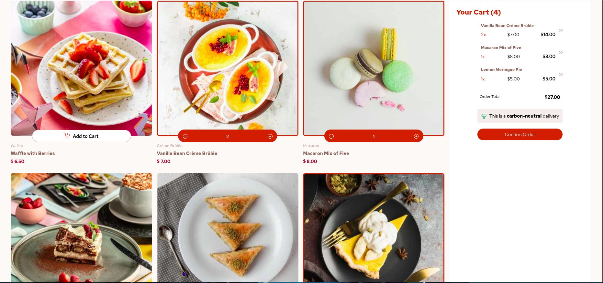

# Frontend Mentor - Product list with cart solution

This is a solution to the [Product list with cart challenge on Frontend Mentor](https://www.frontendmentor.io/challenges/product-list-with-cart-5MmqLVAp_d). Frontend Mentor challenges help you improve your coding skills by building realistic projects.

## Table of contents

- [Overview](#overview)
  - [The challenge](#the-challenge)
  - [Screenshot](#screenshot)
  - [Links](#links)
- [My process](#my-process)
  - [Built with](#built-with)
  - [What I learned](#what-i-learned)
  - [Continued development](#continued-development)
  - [Useful resources](#useful-resources)
- [Author](#author)
- [Acknowledgments](#acknowledgments)

## Overview

### The challenge

Users should be able to:

- Add items to the cart and remove them
- Increase/decrease the number of items in the cart
- See an order confirmation modal when they click "Confirm Order"
- Reset their selections when they click "Start New Order"
- :white_check_mark: View the optimal layout for the interface depending on their device's screen size
- See hover and focus states for all interactive elements on the page

### Screenshot



### Links

- Solution URL: [Add solution URL here](https://github.com/samoina/product-list-cart-fem)
- Live Site URL: [Add live site URL here](https://samoina-product-list-cart-fem.vercel.app/)

## My process

### Built with

- Semantic HTML5 markup
- CSS custom properties
- Flexbox
- CSS Grid
- Mobile-first workflow
- [React](https://reactjs.org/) - JS library

### What I learned

#### Creating local and global state

Once I had the design up, i needed to figure out a way to update the cart items for the specific cart and then the sum total for all the items added. Initially I just set Global State but this meant that on every subsequent click, each cart item would have the global count. To get around this, I first created local state in the Cart Order component that would inrease or decrease individually depending on what is selected. Then, I would update the Global Counter accordingly using the Global State and this worked.

```tsx
//get initial state value from global state
const globalCounterToUpdate = useHookstate(GlobalCounter);

//create local state to keep track of the specific order amount per product
const localCounter = useHookstate(0);

const handleIncrement = () => {
	localCounter.set((lc) => lc + 1);
	globalCounterToUpdate.set((gc) => gc + 1);
};

const handleDecrement = () => {
	if (localCounter.get() > 0) {
		localCounter.set((lc) => lc - 1);
		globalCounterToUpdate.set((gc) => gc - 1);
	}
};
```

#### My components re-rendered multiple times

whenever the global state changed (which would happe when I updated the local state to 'add to cart' which in turn changed global state and reset the button), the Cartcard component re-renderd and caused the button to reset yet i wanted it to persist and show the (-) and (+) buttons.

I am learning that state does not change variables - it imply triggers a re-render. which is what happens when i click on 'add cart' as this re-renders the UI.

setting stte only changes it for the next render. (it helps to mentally replace the state variable with their values.) even with a settimeout, React takes a snapshot of the time that the user interacted with the component.

Found out that I could use `useRef` to manipulate the DOM. first, i declare a ref object and set its initial value to null and then pass the ref objct as an attribute to he jsx of he DOM i want to manipulate. this still didnt work as i expeted so i checked React dev tools to see what was re-rendering - abd i learned it was the selected Cart order and the parent App.

The first thing that i did to remedy this was to:

1. edit the way in which i was extracting the propertes from the global state and this eliminated the re-rendering of the SelctedCartOrder component.

```js
//before, i was accesing the order.get() name directly in the return statement.
...
return (
    <div>
        <p>Name: {order.get().name}</p>
        <p>Price: ${order.get().price.toFixed(2)}</p>
    </div>
);
...

//now i am doing it before the return statement
const counter = useHookstate(GlobalCounter);
const order = useHookstate(GlobalOrder);

const { name, price } = order.get();
```

#### Re-rendering

1. anything that uses global state within the component tree will re-render when the counter changes - which is what makes the buttons not persist. and in my case, using crypto.randomUUID() as the key generates a new unique key makng React treat the component as new, thus reseting the state. this took me too long to realize!!

#### I needed to get the product name from the Cartcard component once clicked, so used useHookstate()

this way, when Add cart is clicked, the global state is updated with the name of the food. the next thing was to figure out how to append instead of simply replacing the order items. to do this, i would need to set the gobal order to an empty array of food items. when the addto cart button is clicked, it pushes the product details (product and price into the array. ) i would also need a 'quantity field' in the array for this.

The idea is to check if the product alread exists and just to update its quantity, instead of adding multiple entries for each product click.

then i get to loop over the array in the selectd cart order. to get the name, quantity, unit price - and the multiply to get the order total.

#### when handling the 'add to cart' function, this is not where i update the cart,

This function is only meant to show the controls, then the - and + buttons handle the adding to the cart order. .set() from hookstate takes in a new value/promise/function returning either of these. the fuction takes the current state value as an arg

#### the total does not update after the initial click of oe, so when the quantity goes up i also need to add the total

perhaps the total also needs to be in the initial order, so i added it to the structure of the initial Order.

#### Clearing the local counters when the user starts a new order

The challenge here was that the local counters are managed in the CartCard, while the call to reset the global state comes from the Orderconfirmed modal.

its proving hard to reset the localcounter from the orderconfirmed modal and pass it up to the selectedCartOrder then up to the CartCard where the local counter us and i am wondering whethe the selectedcartorder should also contain the modal instead of it been a separate component

1. i combined the modal into the SelectedCartOrder to make one component
2. Create a new global state that will be changed when the handleNewOrder() function is called.
3. in the CartCard where the local state is, add the trigger value as a dependency, so that when that changes, then the localcounter is cleared.

#### Click the x icon to remove an item from the cart

the catch is to remove the item from the cart and clear the local counters without the global reset. the global reset changes the local counter so that when it restarts, the LC and the globalcounter do not match.

I finally figured this out by doing the following:

1. On clicking the X icon, take note of the product name
2. create global state to keep track of the removed food item
3. when the x icon is clicked, se the global state to include the specific product, and also modify the order.
4. Back to the cartcard, subscribe to the Global Removed Item State and place it in a useeffect, so that if the removed item in state matches the product name, reset that specific local counter to 0, remove the counter controls and then reset the global removed state to prevent re-renders. this use effect is dependent on the removedItem(from state) and the product name (in the cart card component)

### Continued development

i will be incorporating an Express.js backend to serve product data from MongoDB.

#### Using react Query to handle the fetching of the products list from the backend.

I first installed React Query, then to the main entry file to define a Query Client and wrap it so that the whole project has access to React Query. I also installed Reactquery devtools to make debugging easier, sand added it to the entry app

### Useful resources

- [How to check if your compnent is re-rendering](https://jsramblings.com/how-to-check-if-your-component-rerendered-and-why/) - This helped me figure out what was causing a re-render so that my buttons wouldn't persist.

## Author

- Frontend Mentor - [@yourusername](https://www.frontendmentor.io/profile/samoia)
- Twitter - [@yourusername](https://www.twitter.com/samoina)

## Acknowledgments

Thanks to [@Ian McBool](https://x.com/McBooll) for his help with my understanding of the separation of concerns with local state (specific to each food item) and global state which encompasses things like the total quantity and cost.
